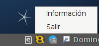
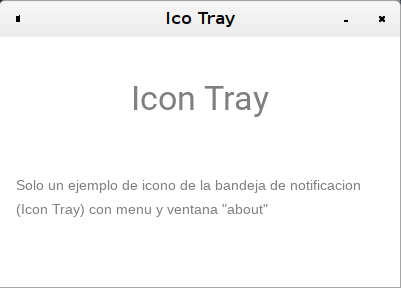

# Serie de ejemplos con Electron

 * [Electron](https://electronjs.org)
 * [Chromium](https://www.chromium.org/)
 * [Node](https://nodejs.org/es/)
 * [v8](https://v8.dev/)

## Tray
Es un pequeño ejemplo que muestra como mostrar un icono en el área de
notificación del sistema.

Además presionando "Información" nos muestra una ventana (Webview HTML+CSS+JS) con
información adicional.

### Ejecutar
<code>
$ electron ./
</code>

## LocalFiles
Ejemplo de lectura y escrituras del sistema de archivo local. Para iniciar este
proyecto utilice "[electron-forge](https://electronforge.io/) init LocalFiles"

Utilizo IPC para la comunicación entre el "proceso principal" y el "render"

### Ejecutar
<code>
$ electron-forge start ./
✔ Checking your system
✔ Locating Application
✔ Preparing native dependencies
✔ Launching Application
</code>
